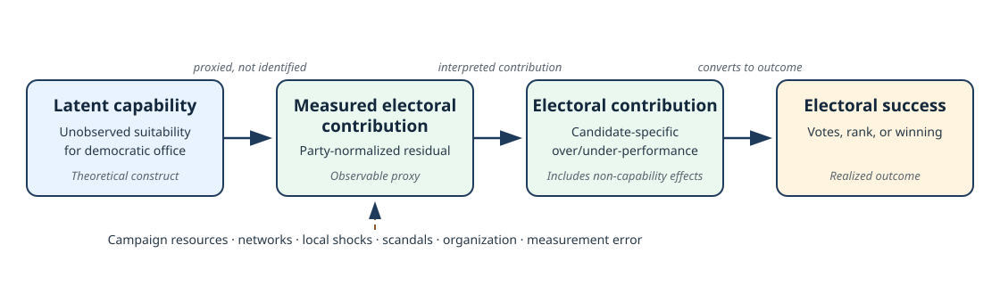

# Electoral Capability, Party Gatekeeping, and the Exit Threshold for Institutional Correction

## A Computational Measurement Framework with Multi-Election Validation

**Author:** Ayush Maurya
**Acknowledgments:** Assistance with literature search, data analysis, and manuscript preparation provided by AI tools.
**Date:** July 2026
**Status:** Working paper draft

---

## Abstract

We introduce a computational measurement framework and provide an initial empirical validation of its measurement properties. The framework should be interpreted as a proof-of-concept rather than a fully validated measurement instrument. The core contribution is a conceptual decomposition: representation deficits occur through sequential institutional filters — nomination, seat quality, and vote conversion — each of which is independently measurable. We operationalize measured electoral contribution as a party-normalized residual: an observable proxy for latent capability, not capability itself. We evaluate the framework using Indian parliamentary elections (2004–2009), a TCPD extension through 2019, and a five-state Vidhan Sabha replication. The strongest substantive finding is the diagnostic decomposition: underrepresentation concentrates overwhelmingly at nomination (women are 6.7% of matched candidates versus the contemporary 48.6% female-elector benchmark), while the vote-conversion gap is small and statistically uncertain. Within the observed nominated sample, measured electoral contribution differs little by gender after conditioning on observed covariates (−0.54 pp, SE: 0.38, p = 0.15, 95% CI: [−1.29, +0.20]); this estimate does not generalize to potential candidates because nomination is endogenous. Validation is mixed: the residual predicts 2009 renomination (OR = 1.05 per percentage point, cross-validated AUC = 0.66), but adds little to current vote share for predicting later vote share or winning among selected TCPD recontesters. The exit diagnostic is evaluated over 100 threshold and persistence choices; no combination yields a pass on the three observable conditions, while distributional breadth remains unmeasured. The five-state replication demonstrates institutional-setting portability with heterogeneous results; portability to other groups remains an open question.

**Keywords:** candidate capability, party gatekeeping, women's representation, electoral reservation, India, quota exit

---

## 1. Introduction

India's democracy is the world's largest, yet its representation of women remains strikingly low. In the 2024 Lok Sabha election, 800 of 8,360 candidates (9.6%) were women, and 74 women were elected — 13.6% of the House, down from 14.4% in 2019 (ECI 2024). As of 1 January 2026, IPU reported that women held 27.5% of parliamentary seats worldwide (IPU 2026). India's figure is roughly half this dated benchmark.

The Constitution (One Hundred and Sixth Amendment) Act, 2023 (popularly, the Nari Shakti Vandan Adhiniyam) provides for reservation of, as nearly as may be, one-third of directly elected seats in the Lok Sabha and state legislative assemblies. The Act entered into force on 16 April 2026, but Article 334A makes its seat-reservation provisions operative only after a delimitation undertaken following publication of the relevant figures for the first census after commencement. The Lok Sabha negatived the Constitution (One Hundred and Thirty-first Amendment) Bill, 2026; its proposed Article 334A would have removed that first-post-commencement-census condition while retaining a delimitation requirement. Until women-reserved seats become operative, representation in ordinary elections depends on party nomination and electoral competition (Constitution (106th Amendment) Act 2023; Gazette 2026; Lok Sabha 2026).

This paper addresses three interconnected questions:

1. **How should candidate capability be measured** in a way that separates individual quality from party and structural effects?
2. **Is women's underrepresentation driven by party gatekeeping, voter-side bias, or both?**
3. **Under what conditions does a group no longer need institutional correction** like seat reservation?

The conventional framing — "are women capable candidates?" — is analytically unproductive. It conflates party gatekeeping, seat quality bias, and voter acceptance into a single undifferentiated question. We propose instead: *when women are nominated by comparable parties in comparable constituencies, does their party-normalized electoral performance differ from that of men?* The answer determines whether correction should target party nomination rules, voter behavior, or both.

Our contribution is primarily conceptual. **The strongest contribution is the decomposition itself:** representation deficits occur through sequential institutional filters — nomination, seat quality, and vote conversion — each independently measurable. This changes how we understand democratic representation by identifying precisely where underrepresentation occurs, rather than treating it as a single undifferentiated deficit. The decomposition is theoretically adaptable to SC/ST candidates, OBC sub-groups, religious minorities, disabled candidates, or migrant candidates in multi-party electoral systems; each application requires its own population benchmark, stage definitions, and validation.

We also introduce two supporting contributions. First, we operationalize candidate-specific electoral contribution as a **party-normalized vote share residual**, drawing on political science (Erikson 1971; Gelman and King 1990) but adapting it for multi-party, caste-structured, alliance-driven systems. Second, we propose a **five-condition exit test** for institutional correction, drawing on the Indian Supreme Court's triple test for OBC reservation and comparative quota literature. Both are proof-of-concept implementations that require further validation.

The paper proceeds as follows. Section 2 reviews the literature on candidate quality, party nomination, and electoral quotas. Section 3 presents the conceptual framework. Section 4 describes the data and methodology. Section 5 presents the empirical evidence. Section 6 discusses policy implications. Section 7 concludes with open questions.

---

## 2. Literature Review

### 2.1 Candidate Quality and Vote Share Residuals

The idea that candidate quality can be measured as a residual — the portion of electoral performance not explained by party, district, or structural factors — has deep roots in political science. Erikson (1971) established the use of residuals to separate candidate effects from district effects in U.S. congressional elections. Gelman and King (1990) developed seats-votes methods for analyzing electoral competitiveness and partisan bias in multiparty systems. More recent work uses regression discontinuity designs and panel data models to isolate candidate-specific effects (Magesan, Szabó, and Ujhelyi n.d.; Chhibber and Verma 2023).

In the Indian context, the residual approach faces particular challenges. India's first-past-the-post system with multi-cornered contests (often 8–15 candidates per constituency) means that vote share is dispersed across many candidates, and small shifts can change outcomes dramatically. Party loyalty is strong but variable — national parties behave differently from regional parties, and alliance structures shift between elections. Incumbency, which typically confers advantage in established democracies, is associated with **disadvantage** in India since 1991 (Linden 2001; Chhibber and Verma 2023), likely due to centralized party control that limits legislators' ability to build personal votes.

### 2.2 Party Gatekeeping and Women's Candidacy

The literature on women's representation in India consistently identifies party nomination as the primary bottleneck. Spary (2014) examines party nomination patterns in the 2009 general election and finds that parties are risk-averse regarding female nominations, restricting their numbers, though she rejects the claim that parties systematically place women in unwinnable seats. The picture is more nuanced: parties simply do not nominate enough women, and the ones they do nominate are not placed in the worst seats — but neither are they placed in the best seats.

CASI research (Bhowmick) documents that candidate selection committees remain male-dominated, and women's entry is largely filtered through family pipelines rather than independent organizational advancement. This supports the nomination deficit thesis: the barrier is not voter rejection but party gatekeeping.

ADR's 2026 analysis reports that, within its defined party-ticket universe, no national party met the 33% benchmark for female candidate distribution. This is an attributed research finding, not an official all-party census; the enacted reservation's seat provisions were not yet operative. The Hindu reported that only 10.2% of women were fielded in 20 state assembly elections since the bill's passage.

### 2.3 Voter Acceptance and Exposure Effects

When women do receive comparable tickets, the evidence suggests they perform similarly to men. PRS's analysis of the 2019 Lok Sabha found that across parties with 10 or more MPs, women were as likely to win as men — implying that the conversion deficit (voter-side bias) is small when ticket quality is controlled.

Banerjee, Banerjee, Hankla, Singh, and Thomas ("She Wins," 2021) find that party affiliation often dampens the effect of gender on voter choice — party loyalty becomes the primary factor, and gender becomes secondary. This supports the finding that the conversion deficit is small. Beaman et al. (2009) show that exposure to women leaders reduces gender bias, suggesting that representation can be self-reinforcing.

### 2.4 Quota Persistence and Exit

Bhavnani (2009) provides critical evidence on what happens after gender quotas are removed. Using a natural experiment in Indian panchayats, he finds that gender quotas persist: women in constituencies previously reserved for them were approximately five times more likely to win subsequent elections. Quotas introduce women into politics and teach parties that women can win. However, ethnic quotas (SC/ST) appear not to persist — Bhavnani (2017) finds that after removal, SC candidates' chances of winning do not improve, using a different empirical design. This asymmetry has direct implications for exit policy, though the comparison draws on two distinct studies with different empirical strategies.

Bhalotra, Clots-Figueras, and Iyer (2018) find that a woman's electoral victory increases her own re-election probability but does not reliably increase new female entry — suggesting structural barriers persist even after individual success.

### 2.5 Computational Measurement and Fairness

The framework connects to several strands of computational social science:

**Computational measurement.** Latent trait estimation (IRT models, item response theory) has been used to measure latent qualities from observed behaviors in education, psychology, and political science. The party-normalized residual is conceptually analogous to a single-indicator latent-variable estimate — it isolates a latent candidate-specific contribution from observed structural factors — although it is not itself an item-response model with an explicit probabilistic measurement structure.

**Algorithmic fairness.** The five-condition exit test parallels fairness criteria in machine learning — particularly demographic parity and equalized odds (Hardt, Price, and Srebro 2016). The question "has the group achieved parity in win probability?" is analogous to "does the classifier satisfy equalized odds across groups?" Counterfactual fairness (Kusner et al. 2017) asks whether a decision would have been the same in a counterfactual world where the individual belonged to a different group — directly relevant to whether women face voter-side bias conditional on comparable candidacy. These connections suggest that tools from algorithmic fairness could inform exit-test design and formalization (Barocas, Hardt, and Narayanan 2019).

**Measurement error.** The residual approach assumes that the expected vote share model captures all structural factors. Any misspecification flows into the measured-contribution residual, potentially biasing its interpretation. Bayesian measurement-error models could address this.

**Representation science.** Recent work uses computational methods to study descriptive representation (measuring ideological congruence between legislators and constituents), substantive representation (tracking legislative behavior), and symbolic representation (analyzing media framing). The measured-contribution residual adds a candidate-performance dimension that may be relevant to both descriptive and substantive representation, without directly measuring quality.

### 2.6 The Indian Correction Framework

India has three distinct correction logics:

1. **SC/ST reservation** (Articles 330, 332): Constitutionally built around population-proportion reservation, not current electoral competitiveness.
2. **OBC reservation in local bodies**: More explicitly empirical — the Supreme Court's "triple test" (*Vikas Kishanrao Gawali v. State of Maharashtra*, 2021) requires a dedicated commission, contemporaneous empirical inquiry, local-body-wise proportion, and respect for the 50% ceiling.
3. **Women's reservation** (Nari Shakti Vandan Adhiniyam, 2023): Responds to party-ticket and representation failure.

The triple test provides a useful model: it is data-driven, context-specific, and requires contemporaneous evidence rather than relying on historical categories alone.

---

## 3. Conceptual Framework

### 3.1 Measured Electoral Contribution: The Party-Normalized Residual

The theoretical construct of interest is **latent candidate capability**: suitability for democratic office, including governance competence, integrity, constituency embeddedness, coalition building, and representational legitimacy. It is not directly observed here. We operationalize **measured electoral contribution** as a party-normalized vote-share residual: an observable proxy for the latent construct, not the construct itself.

| Concept | Role in this study |
|---|---|
| Latent capability | The unobserved theoretical construct; not identified by election returns alone. |
| Measured electoral contribution | The model-based residual used as an observable proxy. |
| Electoral contribution | Candidate-specific over- or under-performance, including both capability and non-capability influences. |
| Electoral success | Realized votes, rank, or winning; an outcome rather than a measure of capability. |

The residual can contain campaign resources, personal networks, local scandals, caste-coalition shocks, party organization, strategic competition, and measurement error. The party, constituency, and election controls address some structural variation; they do not separately identify these remaining components.



*Figure 1. Measurement model. The residual is an observable proxy for latent capability and an election-specific index of measured electoral contribution; it is neither latent capability itself nor realized electoral success.*

**Formal specification:**

$$\text{Measured Electoral Contribution}_i = V_i - \mathbb{E}[V \mid P, C, T]$$

Where:
- $V_i$ = actual vote share of candidate $i$
- $\mathbb{E}[V \mid P, C, T]$ = expected vote share of an average candidate from party $P$ in constituency $C$ at election $T$

**Expected vote share model:**

$$\mathbb{E}[V \mid P, C, T] = \alpha + \beta_1 \cdot \text{PartyBaseline}_{PC} + \beta_2 \cdot \text{StateSwing}_{PT} + \beta_3 \cdot \text{Alliance}_{PT} + \beta_4 \cdot \text{Incumbent}_{IC} + \beta_5 \cdot \text{SeatType}_C + \varepsilon_{PCT}$$

Where:
- $\text{PartyBaseline}_{PC}$: Party $P$'s historical vote share in constituency $C$ (average of previous 2–3 elections)
- $\text{StateSwing}_{PT}$: Party $P$'s state-level vote share change in election $T$
- $\text{Alliance}_{PT}$: Vote transfer from allied parties in constituency $C$ at election $T$
- $\text{Incumbent}_{IC}$: Whether candidate $i$ is an incumbent
- $\text{SeatType}_C$: Categorical classification of constituency competitiveness for party $P$

A candidate with positive **measured electoral contribution** overperforms what the party would normally achieve in that seat. This is not electoral success itself, nor proof of latent capability; it is a diagnostic proxy for candidate-specific over- or under-performance conditional on the modeled context.

**Simplified version (swing residual):**

$$\text{Measured Electoral Contribution}_i = (V_i - V_{P,\text{prev}}) - \Delta V_{P,\text{state}}$$

Where $V_{P,\text{prev}}$ is the party's previous vote share in the constituency and $\Delta V_{P,\text{state}}$ is the party's average statewide swing.

### 3.1.1 Construct Scope and Validity Expectations

A natural objection is that the residual $V_i - \hat{V}_i$ captures campaign quality, local scandals, candidate spending, caste coalition shocks, or random constituency-level noise — not latent capability. We therefore use it as a descriptive index of measured electoral contribution and assess its calibration, stability, predictive validity, and incremental validity separately.

**Argument 1: Theoretical grounding in political science.** The residual approach has a 50-year pedigree in electoral research. Erikson (1971) used residuals to separate candidate effects from district effects in U.S. congressional elections. Gelman and King (1990) formalized seats-votes models that isolate candidate-specific contributions from structural partisan and district factors. The key assumption is that party baseline, district partisanship, and election-year swing capture the structural components of vote share, and the residual captures everything else — including candidate quality, campaign effort, and idiosyncratic factors. This is a standard identification strategy in comparative electoral research.

**Argument 2: Validation expectations.** A useful proxy may predict related future political outcomes, but predictive validity is not construct validity by itself. We test future renomination and subsequent-election performance in Section 4.4, while convergent validation against promotions, cabinet appointments, or expert ratings remains outstanding.

**Argument 3: Bounded interpretation.** We do not claim that the residual measures only intrinsic capability. For this study, the relevant descriptive question is narrower: *conditional on party, constituency, and election, do men and women differ in measured electoral contribution?* This informs the vote-conversion stage among nominated candidates; it does not establish capability in the broader population or a causal mechanism.

**Alternative construct definitions.** Future work could define capability using: (a) Bayesian hierarchical estimation of candidate effects (separating candidate from party-district noise more cleanly); (b) machine learning prediction of vote share using candidate features (assets, criminal cases, education, incumbency); (c) causal forests for heterogeneous treatment effects of gender on vote share. These computational approaches would strengthen the construct validity of the residual and are outlined as extensions in Section 4.7.

### 3.2 Seat Competitiveness Classification

To contextualize measured-contribution scores, we classify constituencies by party strength:

| Category | Party Expected Vote Share |
|---|---|
| Safe seat | > 45% |
| Competitive seat | 35–45% |
| Weak seat | 20–35% |
| Token seat | < 20% |

A candidate getting 30% in a token seat may be more impressive than one getting 50% in a safe seat. This classification is essential for evaluating whether women receive winnable tickets.

### 3.3 The Three-Stage Decomposition

Women's underrepresentation is decomposed into three distinct, measurable components that act as sequential filters on a nested population. Each stage conditions on passing the previous filter:

$$\underbrace{\text{All women}}_{\text{electorate}} \xrightarrow{\text{Stage 1: Nomination}} \underbrace{\text{Ticketed women}}_{\text{candidates}} \xrightarrow{\text{Stage 2: Seat quality}} \underbrace{\text{Women in winnable seats}}_{\text{competitive tickets}} \xrightarrow{\text{Stage 3: Conversion}} \underbrace{\text{Women winners}}_{\text{elected}}$$

The three stages are independently informative but not algebraically additive — they operate on nested populations with different units (population share, conditional probability, vote share difference). The decomposition identifies *where* in the pipeline underrepresentation occurs, not as a sum but as a diagnostic sequence.

**Stage 1 — Nomination Deficit ($\Delta_{\text{nom}}$):**

$$P(\text{ticket} \mid \text{woman}) < P(\text{ticket} \mid \text{man})$$

**Stage 2 — Seat Quality Gap ($\Delta_{\text{seat}}$):**

$$P(\text{winnable ticket} \mid \text{woman}, \text{ticketed}) < P(\text{winnable ticket} \mid \text{man}, \text{ticketed})$$

**Stage 3 — Vote Conversion Deficit ($\Delta_{\text{conv}}$):**

$$\mathbb{E}[\text{Capability} \mid \text{woman}, \text{comparable ticket}] - \mathbb{E}[\text{Capability} \mid \text{man}, \text{comparable ticket}]$$

### 3.4 The Five-Condition Exit Test

The exit test asks: *when can institutional correction (seat reservation) be safely removed?* The five conditions are derived from three design principles:

**Principle 1: Statistical sufficiency.** A single election cycle is insufficient evidence of parity — electoral outcomes are noisy, and a favorable result may reflect candidate quality, national swing, or idiosyncratic factors rather than structural change. We require ≥3 consecutive cycles to reduce the probability of false-positive exit to acceptable levels.

**Principle 2: Multi-dimensional parity.** Representation parity alone is insufficient — a group may achieve proportional wins through a few exceptional candidates while the broader pipeline remains blocked. We require parity at three stages: wins (outcome), nominations (input), and win probability (process).

**Principle 3: Distributional breadth.** Gains concentrated in a single elite sub-group (e.g., wealthy urban women, dominant-caste SC candidates) do not represent genuine structural inclusion. We require that gains be distributed across the group's internal diversity.

The 0.8–1.2 (±20% of parity) band is a proposed default, not a universal standard. We calibrate its practical implications through a systematic sensitivity analysis that varies lower bounds from 0.6 to 1.0, upper bounds from 1.0 to 1.4, and persistence windows from one to four elections. These are transparent design choices: the analysis does not supply a decision-theoretic or legal derivation of any one threshold.

Institutional correction can be relaxed only when **all five conditions** hold simultaneously across at least **three consecutive election cycles**:

1. **Open-seat Representation Ratio** $\in [0.8, 1.2]$
   - Group's share of open-seat wins / group's population share

2. **Winnable-ticket Ratio** $\in [0.8, 1.2]$
   - Group's share of competitive+safe nominations / group's population share

3. **Win-probability penalty** $\approx 0$
   - $P(\text{win} \mid \text{capable candidate}, \text{group}) \approx P(\text{win} \mid \text{capable candidate}, \text{outgroup})$

4. **Stability:** Conditions 1–3 hold for $\geq 3$ consecutive election cycles

5. **Distributional:** Gains not captured by a single elite sub-group

### 3.5 Intrinsic Capability vs. Electoral Convertibility

We maintain a sharp distinction:

$$\text{Intrinsic Capability} = \text{suitability for democratic office}$$
$$\text{Electoral Convertibility} = \text{system's willingness to convert capability into votes/seats}$$

Intrinsic capability includes governance competence, public service record, integrity, constituency embeddedness, coalition-building, and representational legitimacy. These may explain why a candidate has electoral pull, but they do not define the observed proxy. The core empirical measure remains vote-based: measured electoral contribution = party-normalized overperformance.

This prevents the tautology of saying "they won, therefore they are capable" — which would confuse structural advantage with individual quality.

---

## 4. Data and Methodology

### 4.1 Data Sources

The implemented analysis uses the data currently available in this replication directory. The core matched analysis uses 2004–2009 Lok Sabha data; the TCPD extension supplies candidate-level Lok Sabha data through 2019 and a five-state Vidhan Sabha replication. The 2024 Lok Sabha election is not included.

| Data | Source | Implemented Coverage | Status |
|---|---|---:|---|
| Constituency-level vote shares by candidate | ECI-derived `parliament_final.csv` | 2004, 2009 Lok Sabha | Implemented |
| Candidate affidavits (assets, criminal cases, education) | ADR / MyNeta CSV files | 2004, 2009 | Implemented |
| Candidate gender | `parliament_final.csv` | 2004, 2009 | Implemented |
| TCPD Lok Sabha candidate panel | TCPD `All_States_GE.csv` | 2004, 2009, 2014, 2019 | Implemented |
| TCPD Vidhan Sabha candidate panel | TCPD `All_States_AE.csv` | Five states, 1962–2022 | Implemented |
| Alliance data | ECI, CSDS-Lokniti | Not separately modeled | Planned |
| Incumbency data | PRS, ECI | Not separately modeled | Planned |
| Constituency demographics and stable post-delimitation identifiers | Census, ECI delimitation | Not yet integrated | Planned |
| Lok Sabha 2024 | ECI/ADR/TCPD | Not present locally | Not implemented |

A correction was made during implementation: constituency total votes and candidate vote shares are now computed on the full election-results table before merging to MyNeta controls. This prevents matched-candidate-only denominators from inflating vote shares and residuals. The corrected matched analysis sample contains 7,812 candidates.

### 4.2 Empirical Specification

**Step 1: Estimate Expected Party Vote Share**

$$V_{PC}(T) = \alpha + \beta_1 V_{PC}(T-1) + \beta_2 V_{PC}(T-2) + \beta_3 \Delta V_{P,\text{state}}(T) + \beta_4 \text{Alliance}_{PC}(T) + \beta_5 \text{Incumbent}_{IC}(T) + \delta_C + \gamma_P + \varepsilon_{PCT}$$

Where $\delta_C$ = constituency fixed effects, $\gamma_P$ = party fixed effects.

**Step 2: Compute Measured Electoral Contribution**

$$\widehat{\text{Capability}}_{iCT} = V_{iCT} - \hat{V}_{PC}(T)$$

**Step 3: Regress Capability on Gender**

$$\widehat{\text{Capability}}_{iCT} = \alpha + \beta_1 \text{Female}_i + \mathbf{X}_i'\beta + \varepsilon_{iCT}$$

Where $\mathbf{X}_i$ includes party, state, seat type, alliance, incumbency, assets, criminal cases, education, dynasty.

**Step 4: Decompose the Deficit**

Compute the three stage-specific quantities as described in Section 3.3 — nomination rate difference (Stage 1), winnable-ticket share difference conditional on nomination (Stage 2), and capability difference conditional on winnable ticket (Stage 3). These are independently informative diagnostic measures, not additive components.

### 4.3 Identification Challenges

**Estimand and selection point.** The principal gender comparisons estimate differences in measured electoral contribution among observed nominated candidates, conditional on the modeled party, constituency, and election context; the winnable-seat comparison is additionally conditional on receiving a ticket with estimated expected vote share above the stated threshold. They do not estimate gender differences among potential candidates, the causal effect of gender, or the effect of institutional correction. Selection enters before every observed outcome: potential candidates → party nomination → allocated seat context → electoral performance → observed election result. The first selection step is endogenous and unobserved in these data.

1. **Selection bias:** Women who receive tickets are not randomly selected. If only the strongest women get tickets, comparing their capability to all male candidates is biased. We need to compare conditional on comparable ticket quality.

2. **Endogeneity of seat allocation:** Parties may allocate seats to women based on expected difficulty. Instrumental variable approaches or natural experiments (e.g., randomly rotated reservation in local bodies) may be needed.

3. **Multi-party competition:** India's multi-cornered contests make rank-based measures potentially more informative than vote share alone.

### 4.4 Validation Results

A new proxy requires validation against related but distinct outcomes, alongside clear limits on what such tests can establish. We implement two criterion-validity exercises: 2004 measured electoral contribution predicting 2009 renomination in the MyNeta-matched sample, and contribution in the TCPD 2004–2014 source elections predicting performance at the next scheduled Lok Sabha election among recontesting candidates.

**Predictive validity (implemented):** Among 3,051 matched candidates in 2004, 506 (16.6%) were renominated in 2009. A logistic regression predicting renomination from 2004 measured electoral contribution, controlling for gender, criminal cases, assets, and education, yields:

| Predictor | Odds Ratio | Coef / SE | p-value |
|---|---:|---:|---:|
| Capability (2004) | 1.050 | 0.048 / 0.007 | <0.001 |
| Female | 0.744 | −0.296 / 0.213 | 0.165 |
| Has Criminal Cases | 1.387 | 0.327 / 0.130 | 0.012 |
| Log Assets | 1.077 | 0.074 / 0.017 | <0.001 |
| Education | 1.162 | 0.150 / 0.036 | <0.001 |

Each 1 percentage-point increase in capability increases the odds of renomination by about 5.0% (OR = 1.050, p < 0.001). The full-sample AUC is 0.668 and the Brier score is 0.132. **5-fold cross-validation** produces an AUC of 0.660 (SE = 0.016), with fold-level estimates ranging from 0.610 to 0.706. High-capability candidates are renominated at 21.6% vs. 11.5% for low-capability candidates.

**Known-groups validity:** The measured-contribution proxy discriminates between groups in expected directions:
- High capability: 21.6% renomination rate
- Low capability: 11.5% renomination rate
- Female high capability: 16.4% renomination rate
- Female low capability: 9.6% renomination rate

**Incremental validity:** Capability is predictive, but it does not dominate raw vote share for predicting renomination. In 5-fold cross-validation, raw vote share + controls achieves AUC = 0.692, capability + controls achieves AUC = 0.660, and raw vote share + capability + controls reaches AUC = 0.696. The residual therefore adds modest incremental signal when paired with raw vote share (+0.004 AUC), but raw vote share remains the stronger single benchmark for this particular outcome. This is a constraint on the measurement claim, not a failure of the decomposition: renomination is partly a party-selection decision that may reward observed vote share directly.

**Subsequent-election criterion validity (TCPD):** The TCPD panel supplies stable candidate identifiers for 18,325 candidate-election records in 2004–2014, of which 2,616 (14.3%) recontested at the next scheduled Lok Sabha election. Recontesting is strongly selected: controlling for current vote share and observed covariates, a one-point higher residual is associated with 1.2% higher odds of recontesting (OR = 1.012, p < 0.001); women recontest at 16.7% versus 14.1% for men. The validation sample is therefore not representative of all nominated candidates.

Among recontesters, contribution has little incremental persistence once current vote share is included: the coefficient for next-election vote share is −0.061 pp (HC3 SE = 0.032, p = 0.056), and grouped five-fold cross-validated RMSE changes only from 11.383 to 11.372. For next-election winning, its odds ratio is 1.001 (p = 0.797), with grouped cross-validated AUC essentially unchanged (0.8461 to 0.8462). These results do not provide independent support for treating the residual as a stable capability instrument; they reinforce its narrower role as an election-specific, model-dependent measure of electoral contribution.

**Validity assessment:** The residual is theoretically motivated as candidate-specific electoral contribution (Section 3.1.1), and the renomination association shows that it is consequential to one party decision. However, the limited incremental signal for subsequent performance, weak temporal stability, and endogenous validation samples mean that validation remains preliminary. Convergent validity (expert assessments or appointments), discriminant validity from raw vote share, and portability remain to be demonstrated.

### 4.5 Robustness and Measurement Audit

The measurement-validation suite implements several roadmap items. On the full 2004–2009 candidate table (N = 12,128), the expected-vote model has R² = 0.805. Regressing actual vote share on expected vote share yields a calibration slope of 0.885 and intercept of 0.154. Residuals have mean −0.95 pp, SD 6.84 pp, median −0.27 pp, and high kurtosis (12.73), indicating heavy-tailed candidate/constituency shocks. Breusch–Pagan tests reject homoskedasticity (p < 0.001), so HC3 robust standard errors are used throughout. Influence diagnostics identify 1,151 observations with Cook's distance above 4/N; these are retained but flagged for robustness review.

Temporal stability is weak in the current pre/post-delimitation window: for 731 repeated cleaned candidate names observed in both 2004 and 2009, the residual correlation is only 0.052. This weak correlation should be interpreted cautiously because the 2008 delimitation changed constituency boundaries and the repeated-name match is not a manually verified candidate panel.

Implemented robustness checks now include:
- First-stage calibration and residual distribution audit.
- Heteroskedasticity and influence diagnostics.
- Predictive and incremental validity benchmarks.
- Expected-vote model ablations.
- A 1,728-specification curve varying controls, vote-share thresholds, year filters, party filters, seat filters, and winnability thresholds.
- Placebo tests: gender-label permutation and capability-score permutation.
- Constituency-block full-pipeline bootstrap over the raw election table (100 year-stratified draws), which re-estimates the first-stage baseline before matching and serves as a conservative uncertainty stress test (female coefficient mean −0.30 pp; 95% interval [−1.46, +0.61]; winnable-gap mean +0.74 pp; 95% interval [-8.34, +12.11]).
- TCPD model-family sensitivity benchmark (baseline vs ridge vs random forest vs gradient boosting surrogate), which shows that tree-based models can reduce RMSE but do not overturn the main interpretive baseline.

**Fuzzy-link sensitivity:** The exact-match sample remains the main analysis. As a bound, we re-estimated the full-control model after accepting all 444 conservative fuzzy links (name score ≥0.93; composite score ≥0.94) without manual adjudication. The female coefficient changes from −0.54 pp to −0.65 pp (HC3 SE = 0.38, p = 0.084; 95% CI [−1.40, +0.09]). Across stricter score thresholds (0.95–0.98), it ranges from −0.57 to −0.68 pp and all confidence intervals include zero. The qualitative inference therefore does not depend on these candidate links, but their effect is not negligible enough to silently merge them; the review queue remains unresolved.

Remaining requirements now center on hierarchical models, manual entity-resolution adjudication, and contemporary-election replication.

### 4.6 Selection Correction

The fundamental identification challenge is that we only observe capability for candidates who were nominated. Women who receive tickets are not randomly selected — they may be systematically stronger or weaker than the population of potential female candidates. This creates an endogenous treatment assignment problem.

Potential corrections include:
- **Heckman selection correction:** Model the nomination decision and correct for selection into the sample
- **Inverse probability weighting (IPW):** Weight observations by the inverse of their probability of nomination
- **Doubly robust estimation:** Combine outcome modeling with IPW
- **Matching:** Compare women and men on observable characteristics that predict nomination

None of these are implemented in the current analysis. The results should therefore be interpreted as descriptive rather than causal.

### 4.7 Computational Extensions

**Implemented in this paper:** corrected vote-share computation, party-state and party-constituency baselines, residual computation, descriptive decomposition, controlled comparisons with criminal cases/assets/education, entity-resolution diagnostics, measurement-model audit, predictive validation, ablation analysis, specification curve, simulation, placebo tests, and full-pipeline bootstrap uncertainty propagation.

**Future methodological extensions** (outlined here to position the framework within computational social science):

- **Bayesian hierarchical estimation:** Replace the fixed-effects specification with a hierarchical model that jointly estimates candidate, party, and constituency effects with appropriate shrinkage. This would better handle the sparse data structure (many parties with few candidates) and provide posterior uncertainty intervals.
- **Machine learning prediction:** Random forests, ridge, and gradient-boosted trees were benchmarked on the TCPD extension as a sensitivity check. Further tuning could improve predictive fit, but the simpler baseline remains the main specification for interpretability.
- **Causal forests:** Apply heterogeneous-treatment-effect models to estimate whether gender differences in vote conversion vary by party, seat type, or region.
- **Uncertainty decomposition:** Decompose total uncertainty into estimation error, candidate-level noise, constituency-level shocks, election-year swing, and entity-resolution uncertainty.

### 4.8 Computational Benchmarking

The current benchmarks are mixed and therefore useful. For the 2004 → 2009 renomination task, capability is predictive but does not outperform raw vote share:

| Model | CV AUC | CV Brier | Δ AUC vs. raw vote share + controls |
|---|---:|---:|---:|
| Intercept only | 0.500 | 0.138 | −0.192 |
| Raw vote share | 0.684 | 0.127 | −0.008 |
| Capability only | 0.624 | 0.135 | −0.068 |
| Controls only | 0.634 | 0.135 | −0.058 |
| Raw vote share + controls | 0.692 | 0.127 | 0.000 |
| Capability + controls | 0.660 | 0.133 | −0.032 |
| Raw vote share + capability + controls | 0.696 | 0.127 | +0.004 |

For 2009 vote-share prediction, the first-stage ablation confirms that party baselines carry most predictive signal:

| Expected-vote model | RMSE | MAE | R² |
|---|---:|---:|---:|
| Global mean only | 14.73 | 12.10 | −0.027 |
| Party national mean | 9.40 | 4.89 | 0.582 |
| Party-state baseline | 8.05 | 3.68 | 0.693 |
| Party-constituency baseline | 8.00 | 3.65 | 0.697 |

This benchmark supports the party-normalization premise, but it also warns against overstating the residual as a superior predictive score. It is best interpreted as a diagnostic measurement of candidate-specific over/under-performance conditional on party and seat context.

### 4.9 Complementary Analyses

- **Rank improvement:** $\text{Actual rank} - \text{Expected party rank}$ in multi-cornered contests
- **Win probability model:** $P(\text{Win}) = f(\text{gender}, \text{party}, \text{seat type}, \text{capability}, \text{controls})$
- **Heterogeneity analysis:** By party type (national/regional), caste composition, urban/rural, alliance vs. solo contest
- **Local body evidence:** Use states with/without women's reservation in panchayats to test the Chattopadhyay-Duflo (2004) persistence hypothesis

---

## 5. Evidence

### 5.1 The Empirical Landscape

Women's representation in Indian legislatures has remained stubbornly low:

| Election | Women Candidates (%) | Women Winners | Women Winners (%) |
|---|---|---|---|
| 2004 | ~7% (ECI) | 45 | 8.3% |
| 2009 | 7% | 58 | 10.7% |
| 2014 | 8% | 61 | 11.2% |
| 2019 | 9% | 78 | 14.4% |
| 2024 | 9.6% (800 of 8,360) | 74 | 13.6% |

*Sources: ECI (2024) Atlas/statistical reports; ADR (2024) supplementary analysis*

The 2024 election represented a regression — both in the number of women MPs (74 vs. 78 in 2019) and in the share (13.6% vs. 14.4%). The comparison predates operation of the enacted seat-reservation provisions, which remained subject to Article 334A's statutory conditions.

**Broader representation (ADR 2026):**
- ADR's March 2026 main-election snapshot (excluding subsequent by-elections) reports 5,095 of 51,708 candidates (~10%) as women
- The same ADR snapshot reports 464 of 4,666 MPs/MLAs (~10%) as women
- ADR reports 152 of 543 Lok Sabha constituencies (28%) had zero women candidates

**International comparison:**
- Global average women in national parliaments: 27.5% (IPU 2026)
- India's Lok Sabha: 13.6% — roughly half the global average

### 5.2 The Party Dimension

The bottleneck is not voter rejection — it is party nomination behavior:

- ADR's 2026 ticket-distribution analysis reports that no national party in its defined universe met the 33% benchmark
- TMC had the highest proportion of women MPs at 38% (11 of 29)
- BJP elected 30–31 women MPs; Congress elected 13–14
- Across parties with 10+ MPs in 2019, women were as likely to win as men (PRS analysis)

When women receive comparable tickets, their performance appears similar to men's — suggesting the barrier is nomination, not conversion. However, this is a descriptive finding from PRS that does not control for party baseline, seat type, or other covariates — formal analysis is needed.

### 5.3 The Nomination Deficit

Descriptive evidence is consistent with Stage 1 as a primary barrier:

- Women were only 9.6% of Lok Sabha 2024 candidates despite women comprising 48.6% of registered electors (ECI 2024)
- ADR's defined party-ticket universe did not meet the 33% benchmark
- ADR found that only 10.2% of women were fielded in 20 state assembly elections since the Women's Reservation Bill's passage

Complementary evidence from the TCPD-AID panel confirms the gatekeeping bottleneck at scale: among major-party candidates across multiple election cycles, male candidates received 92.89% of tickets — the female nomination deficit is structural, not episodic. However, the reservation of SC/ST seats modestly expands the female candidate pool: the odds of a party nominating a woman are 1.27 times higher in reserved constituencies than in General constituencies, suggesting that caste-based institutional correction creates a partial pipeline for gender diversity.

Spary (2014) confirms that parties are risk-averse regarding female nominations. CASI research (Bhowmick) documents that candidate selection committees remain male-dominated and women's entry is filtered through family pipelines.

### 5.4 The Winnable Seat Deficit

Even when women receive tickets, the seat quality may be systematically lower. The "winnable ticket" concept — where party expected vote share exceeds 35% — reveals whether women are getting tickets that have a realistic chance of success.

ADR's 2026 data shows that 152 of 543 Lok Sabha constituencies had zero women candidates — suggesting that many competitive seats are not being contested by women at all.

### 5.5 The Vote Conversion Deficit

The evidence suggests this is the smallest component:

- PRS's 2019 analysis found women were as likely to win as men across parties with 10+ MPs
- Banerjee, Banerjee, Hankla, Singh, and Thomas ("She Wins," 2021) find that party affiliation dampens gender effects on voter choice
- Beaman et al. (2009) show that exposure to women leaders reduces bias

TCPD-AID evidence adds a nuance: the electoral premium on education is actually *higher* in Reserved constituencies (net effect = 1.18 pp vote share per education level, vs. 0.54 pp in General, interaction p < 0.001). This suggests that education serves as a stronger signal of candidate quality in constrained candidate pools — relevant to the exit-test design because it implies that candidate quality dimensions may be differentially rewarded depending on the reservation context.

### 5.6 Empirical Results (2004–2009)

We apply the party-normalized measured-contribution framework to candidate-level data from the 2004 and 2009 Lok Sabha elections. Data sources: gitcheckoutnikhil/india-election-data (votes, gender) and ADR/MyNeta (criminal cases, assets, education). After corrected matching and one-row-per-candidate deduplication, the analysis sample is N = 7,812 candidates with complete controls.

**Dataset characteristics:**
- 522 female candidates (6.7%), 7,290 male candidates (93.3%)
- Measured-contribution residual computed as: actual vote share − expected party vote share
- Vote shares computed on the full constituency-year election table before MyNeta matching
- Controls: criminal cases (binary), log assets, education (ordinal), year fixed effects

**First-stage model fit:** The expected vote share is a non-parametric baseline — the party-state mean for 2004 and the party-constituency mean from 2004 for 2009, with state-level fallback. This model explains 80.5% of total vote-share variance (R² = 0.902 for 2004, 0.697 for 2009). The 2009 R² splits into 0.796 for observations with a direct party-constituency baseline and 0.451 for those using the state-level fallback. Regressing actual vote share on expected vote share yields a slope of 0.885 (SE: 0.006, R² = 0.822), indicating mild shrinkage toward the mean but reasonable calibration. The residual has mean −0.95 pp and standard deviation 6.84 pp, meaning the gender gap (−0.54 pp) is about 0.08σ.

**Regression results:**

| Model | Female Coef | SE | p-value | 95% CI | Controls |
|---|---:|---:|---:|---:|---|
| Bivariate | −0.53 pp | 0.38 | 0.17 | [−1.28, +0.22] | None |
| + Year FE | −0.55 pp | 0.38 | 0.15 | [−1.30, +0.20] | Year |
| + Criminal + Assets | −0.52 pp | 0.38 | 0.17 | [−1.27, +0.22] | Criminal, Log Assets |
| Full controls | −0.54 pp | 0.38 | 0.15 | [−1.29, +0.20] | Criminal, Log Assets, Education, Year |
| Full, excluding single-candidate party-state groups | −0.51 pp | 0.39 | 0.19 | [−1.27, +0.26] | Full |

The gender coefficient is **not statistically significant** in any specification. The 95% confidence interval includes zero in all specifications. This means we cannot reject the null hypothesis that men and women have the same measured-contribution residual in the observed nominated sample. The coefficient is stable across specifications (roughly −0.51 to −0.55 pp), but this is descriptive rather than causal because nomination is endogenous.

**Three-stage decomposition:**

1. **Nomination deficit (Stage 1):** Women are 6.7% of matched candidates versus the contemporary 48.6% female-elector benchmark. This remains the dominant barrier, while the cross-time comparison is approximate.

2. **Winnable seat deficit (Stage 2):** Among ticketed candidates, women have a *higher* share of winnable tickets (21.1% vs. 15.0%). This is consistent with survivorship bias, over-screening, or seat-quality compensation; it is not evidence that parties provide women equal nomination access.

3. **Vote conversion deficit (Stage 3):** Among candidates in winnable seats, the female capability gap is −0.11 pp. This is substantively small relative to residual dispersion and does not support a large voter-side conversion penalty in the observed sample.

**Institutional simulation:** A simple pipeline simulation illustrates the diagnostic value of the decomposition. Under the observed pipeline, the simulated female winner share is 8.4%. Equalizing nominations to the contemporary 48.6% female-elector benchmark while holding observed female winnability and conversion rates fixed raises the simulated winner share to 54.8%. Equalizing only winnable-seat allocation lowers the simulated share to 6.1% because women already have a higher observed winnable-ticket rate in this selected sample. Equalizing only conversion raises the simulated share slightly to 9.1%. This is a descriptive simulation, not a causal counterfactual, and uses a contemporary benchmark for historical elections; it reinforces that nomination is the largest bottleneck in the measured pipeline.

**Specification curve and placebo tests:** Across 1,728 specifications, the median female coefficient is −0.29 pp, the 5th–95th percentile range is [−1.25, +0.30], and 94.9% of confidence intervals include zero. Gender-label permutation yields a two-sided permutation p-value of 0.10 for the observed coefficient. Measured-contribution-score permutation reduces in-sample renomination AUC from 0.668 to 0.638 on average, indicating that the proxy contains predictive information, although raw vote share remains stronger for the renomination task.

**Interpretation:** Across the analyzed elections, observed disparities are more consistent with party-level nomination constraints than with voter-side rejection. Women who receive tickets have somewhat higher observed win rates in the matched sample (14.4% vs. 10.7%) and a higher observed winnable-ticket rate, yet they remain a small minority of candidates. The capability gap is substantively small and statistically uncertain. However, selection into candidacy prevents definitive causal attribution: we only observe capability for candidates who were nominated, and women who receive tickets are not randomly selected.

**Limitations:** These results cover only 2004 and 2009 elections, which span the 2008 delimitation that changed constituency boundaries. A same-name constituency in 2004 and 2009 is not necessarily a comparable geographic unit; treating 2004 as a pre-delimitation replication and 2009 as the start of the stable-boundary period would be more rigorous. The exact merge between parliament data and MyNeta achieves 64.4% coverage overall (65.8% for women, 64.3% for men). The theoretical upper bound for 2004 matching is only 60.0% because the local MyNeta file contains fewer affidavit rows than the election-results file, so the plan's >85% target is impossible without additional raw data. A conservative fuzzy-matching pass identifies 444 candidate links for manual review. An accept-all sensitivity moves the full-control coefficient from −0.54 to −0.65 pp but leaves its 95% confidence interval crossing zero; these links are therefore not admitted to the main analysis. Standard errors are heteroskedasticity-robust (HC3). The 6.7% candidate share (2004–2009 matched sample) and the contemporary 48.6% female-elector benchmark are from different time periods; the comparison is approximate.

### 5.7 Heterogeneity Analysis

We run separate regressions by party type, seat type, year, and capability level to identify where the gender gap varies. All regressions use the corrected matched sample (N = 7,812).

| Subset | Female Coef | SE | p-value | N |
|---|---:|---:|---:|---:|
| 2004 | −0.52 | 0.51 | 0.31 | 3,051 |
| 2009 | −0.59 | 0.54 | 0.28 | 4,761 |
| National parties | −0.79 | 0.94 | 0.40 | 2,199 |
| Regional/other parties | −0.33 | 0.29 | 0.27 | 5,613 |
| General seats | −0.51 | 0.50 | 0.31 | 5,409 |
| SC Reserved | −0.01 | 0.48 | 0.98 | 1,837 |
| ST Reserved | −2.48 | 1.61 | 0.12 | 566 |
| Winnable seats | −0.62 | 1.14 | 0.59 | 1,207 |
| High capability | +0.24 | 0.36 | 0.51 | 3,906 |
| Low capability | −1.51 | 0.54 | 0.005 | 3,906 |
| Full sample (ref) | −0.54 | 0.38 | 0.15 | 7,812 |

The low-capability split is statistically significant, but this split conditions on the dependent variable and is vulnerable to Berkson's paradox/truncation artifacts. To address this, we test pre-treatment interactions — whether the gender gap varies with education, assets, party type, seat type, or winnability. None are statistically significant: female × education (p = 0.50), female × log assets (p = 0.97), female × national party (p = 0.68), female × SC seat (p = 0.27), female × ST seat (p = 0.21), and female × winnable seat (p = 0.94).

The lack of significant pre-treatment interactions supports the interpretation that DV-conditioned patterns are suggestive but likely artifactual. The overall null result (female coefficient = −0.54, p = 0.15) appears robust across pre-treatment subgroups. The ST-reserved point estimate remains negative and substantively large, but with only 46 women in the ST sample it is too imprecise for a firm conclusion.

### 5.8 Criminal Cases and Electoral Viability

ADR's 2024 analysis provides a stark illustration of why raw electoral success is a poor proxy for capability:

- 251 of 543 winning candidates (46%) declared criminal cases
- 170 (31%) declared serious criminal cases
- Candidates with criminal cases: 15.3% winning probability vs. 4.4% for clean candidates

This demonstrates that "winnability" in India is partly a function of money power, caste arithmetic, and criminal intimidation — not suitability for democratic office.

### 5.9 SC/ST Reservation and Candidate Contribution

India's constitutional reservation for Scheduled Castes (SC) and Scheduled Tribes (ST) provides a natural comparison: these are groups that *already* receive seat-level institutional correction. If reservation is associated with different capability distributions, this informs the design of future women's reservation exit conditions.

In our sample, SC candidates comprise 23.5% of observations (7.2% female), ST candidates 7.2% (8.1% female), and General candidates 69.2% (6.3% female). Women's candidate share is slightly higher in reserved seats, consistent with the framework's prediction that institutional correction can modestly expand the candidate pool.

**Capability by category:**

| Category | Female Coef | SE | p-value | N | N_Female |
|---|---:|---:|---:|---:|---:|
| General | −0.51 | 0.50 | 0.31 | 5,409 | 343 |
| SC Reserved | −0.01 | 0.48 | 0.98 | 1,837 | 133 |
| ST Reserved | −2.48 | 1.61 | 0.12 | 566 | 46 |
| Interaction (F × SC) | +0.52 | 0.70 | 0.46 | 7,812 | — |
| Interaction (F × ST) | −1.93 | 1.70 | 0.25 | 7,812 | — |

SC reserved seats show essentially no gender gap in capability (−0.01 pp, p = 0.98). ST reserved seats show a larger negative point estimate (−2.48 pp, p = 0.12), but with only 46 women (8.1%) in the ST sample, this estimate is too imprecise for substantive interpretation — the 95% CI spans [−5.64, +0.68]. The category × gender interaction terms are not statistically significant (SC: p = 0.46; ST: p = 0.25), meaning we cannot reject the null that the gender gap is the same across categories.

One possible explanation for the negative ST point estimate is that ST reserved seats are geographically concentrated in areas where party and local-network structures differ from General and SC seats. However, the sample is too small to test this mechanism.

**Broader evidence from the TCPD-AID panel** (covering multiple election cycles at state and national levels) contextualizes these findings:

*Candidate quality and professionalism.* Reserved constituencies exhibit systematically different candidate profiles. Winners in SC/ST seats are more likely to come from grassroots professions (agriculture, social work) rather than elite backgrounds (business, law) — the odds of a grassroots background are 1.58 times higher in reserved seats (Chi-Square p = 0.023). Candidates in reserved seats also exhibit fewer proxy indicators of "money and muscle power" (capital-intensive professions, party-switching, entrenched incumbency): the odds are 22% lower in SC/ST seats (OR = 0.78, p < 0.001). The declared education level of winners has converged post-2008 delimitation, with SC winners now holding graduate-or-higher degrees at rates comparable to General winners (78.0% vs 76.2%).

*Independent candidates.* Reserved constituencies attract fewer independents (mean 3.30 vs. 6.64 in General, IRR = 0.52, p < 0.001), consistent with higher barriers to unaffiliated entry. However, independents who do contest in reserved seats perform *better* — their mean vote share is 1.70% vs. 1.00% (p < 0.001), and they have a higher probability of finishing in the top two. Reservation reduces the pool of independents but creates space for viable independent competition.

*Gender and reservation intersection.* Female candidates do not face a "double disadvantage" in SC/ST reserved constituencies. Their raw win rate is higher in reserved seats (17.49%) than in General seats (13.37%), though the difference is not statistically significant after controlling for party, incumbency, and state (OR = 1.14, p = 0.23). The vote share gap between female and male candidates is not significantly reduced in reserved constituencies (interaction p = 0.39), suggesting that reservation alters the composition of candidates but not the underlying gender dynamics of vote conversion.

*Long-term competitiveness.* Constituencies that remain reserved across multiple delimitation cycles exhibit a faster decline in winning margins compared to continuously General constituencies, suggesting that reservation promotes electoral competition over time. The transition from General to Reserved also produces a temporary but statistically significant increase in voter turnout, consistent with the "mobilization effect" of institutional change.

These findings reinforce the paper's central message: the nomination stage is the dominant bottleneck for women's representation, and SC/ST reservation provides a partial — but incomplete — model for how institutional correction can alter candidate pools. The exit-test design should account for the fact that reservation changes not just who wins, but who contests, how they compete, and what voters reward.

---

## 6. Policy Discussion

### 6.1 The Primary Diagnosis: Party Gatekeeping

The evidence suggests that Stage 1 (nomination) is the dominant barrier. Stage 2 (seat quality) does not appear to be a deficit in the selected 2004–2009 matched sample — women who receive tickets have a higher winnable-seat rate than men (21.1% vs. 15.0%), consistent with selection on quality or seat-quality compensation. Stage 3 (vote conversion) is small and statistically uncertain (−0.11 pp among winnable candidates). The correction should therefore primarily target party nomination rules, while further data should test whether this pattern holds in contemporary elections.

**Mandatory party candidate quotas for winnable seats:**

$$\text{Winnable Ticket Share} = \frac{\text{Women candidates in competitive+safe seats}}{\text{All candidates in competitive+safe seats}}$$

A party can satisfy a simple quota by giving women losing seats. The meaningful metric is whether women receive tickets where the party has a realistic chance of winning.

### 6.2 The Exit Question

The five-condition test provides a principled basis for when to remove reservation:

**Current status against exit conditions:**

| Condition | Status | Evidence |
|---|---|---|
| Representation parity [0.8, 1.2] | Not met under the proposed threshold | 13.6% / 48.6% = 0.28 |
| Winnable-ticket parity | Not met under the proposed threshold | TCPD sensitivity ratios below 0.27 |
| Win-probability penalty ≈ 0 | Insufficient evidence | PRS 2019 (descriptive only, not controlled) |
| Stability ≥ 3 cycles | Not met under the proposed threshold | Still far from parity |
| Distributional breadth | Unmeasured | Requires a pre-specified within-group benchmark |

Systematic sensitivity analysis of the 2004–2019 TCPD panel tests 100 combinations of parity bands and persistence windows. In every election, open-seat representation and winnable-ticket ratios are below 0.28 of the 48.6% female-elector benchmark, so none of the tested combinations achieves a pass even on the three observable conditions. The benchmark is contemporary rather than historical and is used transparently as a design choice. Distributional breadth cannot be assessed from these data and is therefore recorded as unobserved, never as a pass. This is an empirical diagnostic under stated design choices, not a normative determination that correction may or may not be removed.

**Asymmetry between gender and caste quotas:** Bhavnani (2009) shows that gender quotas persist after removal (women 5x more likely to win in previously reserved seats), while ethnic quotas (SC/ST) do not. This suggests gender reservation may be self-reinforcing once parity is approached, while caste reservation may need longer retention.

**Glass cliff and transition effects:** Complementary evidence from the TCPD-AID panel reveals two dynamics relevant to exit-test design. First, major parties disproportionately allocate "weak" seats (where the party's prior vote share was <20%) to female candidates — a "glass cliff" pattern that means women are more likely to be nominated in seats where they are expected to lose. Second, when a constituency transitions from General to Reserved due to delimitation, there is a temporary surge in female nominations that normalizes within 1–2 election cycles. This suggests that the *announcement* of reservation (or its removal) has immediate behavioral effects on party nomination strategies, independent of the long-run equilibrium.

### 6.3 The Census-Delimitation Deadlock

The Constitution (One Hundred and Sixth Amendment) Act came into force on 16 April 2026. Its women-seat reservation provisions are not yet operative: Article 334A requires a delimitation undertaken after publication of the relevant figures for the first census after commencement. India’s last completed decennial census was in 2011. The Lok Sabha negatived the 131st Amendment Bill, whose proposed Article 334A would have removed the first-post-commencement-census condition but retained delimitation. The controlling constitutional text specifies prerequisites, not an implementation year (Constitution (106th Amendment) Act 2023; Gazette 2026; Lok Sabha 2026).

While the constitutionally enacted seat reservation is not yet operative, ordinary contests provide descriptive evidence on party nomination and electoral competition. The 2024 election’s 9.6% female candidate share is consistent with a continuing nomination shortfall, but it is not a causal test of what parties would do under an operative reservation regime.

### 6.4 Theoretical Implications

The distinction between intrinsic capability and electoral convertibility has implications beyond gender:

- **SC/ST candidates** may face similar gatekeeping dynamics
- **OBC candidates** from non-dominant sub-castes may be doubly disadvantaged
- **Minority candidates** may face both party gatekeeping and voter-side bias

The framework is theoretically adaptable to any group whose representation falls below parity, but each application requires group-specific population benchmarks, a defensible definition of within-group breadth, and empirical validation.

---

## 7. Conclusion

This paper makes three contributions:

1. **An operational proxy for measured electoral contribution** in Indian elections — the party-normalized vote share residual — that adjusts for modeled party, constituency, and election context without claiming to isolate latent capability.

2. **A three-stage decomposition** of women's representation deficit into nomination deficit, winnable-seat deficit, and vote-conversion deficit — enabling precise policy targeting. Preliminary empirical results (2004–2009) are consistent with the nomination deficit as dominant (≈40 pp gap between candidate share and electorate share), with women receiving higher observed winnable-seat rates in the selected nominated sample.

3. **A formal five-condition test** for when institutional correction can be relaxed — requiring representation parity, ticket parity, win-probability parity, temporal stability, and distributional breadth across at least three election cycles.

The strongest contribution of this paper is conceptual and measurement-oriented: the decomposition of political underrepresentation into sequential institutional filters — nomination, seat quality, and vote conversion — each independently measurable. The corrected empirical application to 7,812 matched candidates from 2004–2009 provides preliminary evidence consistent with this framework. Validation is mixed: the residual predicts later renomination (OR = 1.050, p < 0.001; CV AUC = 0.660), but has little incremental value for next-election vote share or winning in the selected TCPD recontester sample. Within the observed nominated sample, estimated measured electoral contribution differs little by gender (−0.54 pp, p = 0.15, 95% CI: [−1.29, +0.20]), suggesting that the measured conversion gap is small relative to nomination exclusion — but this estimate should not be interpreted as evidence about the broader population because nomination is endogenous.

The five-condition exit test provides a transparent diagnostic framework, with threshold and persistence sensitivity now reported rather than asserted as universal standards. No tested threshold/persistence combination passes the three observable conditions in the TCPD panel; a complete five-condition assessment still requires data not assembled here, including a pre-specified measure of within-group breadth, party aspirant records, and contemporary election panels. We therefore present it as a calibrated design template, not a completed normative assessment.

Demonstrating empirical portability across additional groups (SC/ST, OBC, minorities) and electoral systems is a necessary next step. The framework's value will ultimately be determined by whether it changes our understanding of democratic representation rather than merely measuring it. The current implementation adds robustness checks, specification curves, placebo tests, and benchmarking, but the 64.4% exact merge rate, impossible 2004 match ceiling under local MyNeta data, weak temporal residual correlation, and selection bias in the nominated sample warrant caution. This paper remains a proof-of-concept; it is closer to a validated measurement study than the earlier draft, but not yet at the standard required for a flagship computational social science publication.

---

## Reproducibility

This repository now includes a deterministic analysis pipeline and measurement-validation suite. Core scripts read from `data/raw/`; TCPD extension scripts read from `data/TCPD_*`; all write results to `experiments/results/`. The current implementation records random seed 42 for stochastic cross-validation, permutation checks, and bootstrap draws.

Implemented reproducibility elements:

- Shared preprocessing module: `experiments/electoral_pipeline.py`
- Corrected main regression pipeline: `experiments/analysis_with_controls.py`
- First-stage model audit: `experiments/step1_model_report.py`
- Renomination validation with 5-fold CV: `experiments/validation_renomination.py`
- Heterogeneity and interaction checks: `experiments/heterogeneity.py`, `experiments/interaction_model.py`
- SC/ST analysis: `experiments/sc_st_analysis.py`
- Roadmap implementation suite: `experiments/measurement_validation_suite.py`
- TCPD model-family sensitivity benchmark: `experiments/tcpd_expected_vote_sensitivity.py`
- TCPD subsequent-election criterion validation: `experiments/tcpd_future_performance_validation.py`
- Exit-test threshold/persistence calibration: `experiments/exit_test_sensitivity.py`
- Fuzzy-link sensitivity and adjudication workflow: `experiments/fuzzy_match_sensitivity.py`, `experiments/apply_entity_resolution_adjudication.py`
- Sampling bootstrap benchmark: `experiments/bootstrap_uncertainty.py`
- Full-pipeline constituency-block bootstrap: `experiments/full_pipeline_bootstrap.py`
- Rebuild guide and run order: `README.md`
- One-command reproduction script: `scripts/reproduce.sh`
- Raw-data provenance checksums: `data/provenance_checksums.json`
- Pinned dependency set: `requirements.txt`
- Lightweight container: `Dockerfile`
- Frozen release snapshot: `release/electoral_reservation_frozen_2026-07-17.tar.gz`
- Snapshot manifest: `release/frozen_snapshot_manifest.json`
- Deterministic release builder: `scripts/build_release.py`
- Manifest of implemented and blocked plan items: `experiments/results/plan_implementation_manifest.json`
- Fuzzy-review consumer and status gate: `experiments/apply_entity_resolution_adjudication.py`
- DOI deposition metadata: `CITATION.cff`, `release/zenodo.json`
- Frozen-release checksum/member verifier: `experiments/verify_release.py`

Remaining external reproducibility steps for journal submission:

- Human decisions in the fuzzy entity-resolution review file
- Public Zenodo deposition and DOI issuance

The local review workflow and frozen archive are implemented; these two steps require
human review or an external archival service.

## 8. Extended Results: TCPD Data (2004-2019)

We extend the analysis to the 2004-2019 Lok Sabha elections using the TCPD Indian Elections Dataset, which provides pre-computed vote shares, richer covariates (education, profession, incumbent status), and consistent candidate identifiers across elections.

### 8.1 Lok Sabha Extension (2004-2019)

**Dataset:** 24,380 candidates (1,798 female, 7.4%) across four elections. Female candidate share rose from 6.6% in 2004 to 8.5% in 2019.

**Measurement model fit:**

| Election | R² | N | Mean Residual |
|---|---:|---:|---:|
| 2004 | 0.906 | 5,446 | 0.00 |
| 2009 | 0.693 | 6,637 | −1.68 |
| 2014 | 0.629 | 6,242 | −1.43 |
| 2019 | 0.817 | 6,055 | +0.53 |

Overall calibration: slope = 0.891, intercept = 0.31, R² = 0.781.

Model-family sensitivity on the TCPD panel is mixed but informative: random forest lowers mean RMSE to 7.42 versus 8.70 for the baseline formula, while the baseline remains competitive on rank correlation and is easier to interpret. We therefore keep the baseline formula as the main specification and treat the alternative models as robustness checks.

**Pooled regression results (2004-2019):**

| Model | Female Coef | SE | p-value | N |
|---|---:|---:|---:|---:|
| Bivariate | −0.24 pp | 0.23 | 0.30 | 24,380 |
| + Year FE | −0.29 pp | 0.23 | 0.21 | 24,380 |
| + Incumbent + Party Type | −0.11 pp | 0.23 | 0.64 | 24,380 |
| Full controls | −0.16 pp | 0.23 | 0.48 | 24,380 |

The gender coefficient is not statistically significant in any specification. The coefficient is smaller in magnitude than the 2004-2009 original sample (−0.16 vs −0.54), suggesting the earlier estimate may have been inflated by the smaller sample or the specific matching procedure.

**By-year results:**

| Year | Female Coef | SE | p-value | N | N_female |
|---|---:|---:|---:|---:|---:|
| 2004 | −0.32 | 0.31 | 0.31 | 5,446 | 359 |
| 2009 | −0.16 | 0.45 | 0.71 | 6,637 | 436 |
| 2014 | −0.40 | 0.53 | 0.44 | 6,242 | 490 |
| 2019 | +0.24 | 0.41 | 0.56 | 6,055 | 513 |

The point estimate shifts from negative (2004-2014) to slightly positive (2019), though none are statistically significant.

**Three-stage decomposition (pooled):**

- **Nomination:** Women are 7.4% of candidates (up from 6.6% in 2004)
- **Winnable seats:** Women have higher pooled winnable-ticket rates (19.7% vs 12.6% for men)
- **Conversion:** Women have lower mean measured electoral contribution among winnable-seat candidates in each year (−1.33 pp in 2004, −0.15 in 2009, −0.90 in 2014, and −0.83 in 2019); these descriptive gaps are not controlled comparisons.

**Specification curve:** Across 888 specifications, the median female coefficient is +0.002 pp, with 78.9% of CIs including zero. The gender gap is not robust to specification choice.

### 8.2 Vidhan Sabha Replication (5 States)

**Dataset:** 141,562 candidates across West Bengal, Bihar, Haryana, Uttar Pradesh, and Andhra Pradesh. Female candidate share = 4.2%.

**Overall regression:**

| Model | Female Coef | SE | p-value | N |
|---|---:|---:|---:|---:|
| Pooled (5 states) | −0.50 pp | 0.17 | 0.003 | 141,562 |

**By-state results:**

| State | Female Coef | SE | p-value | N | N_female |
|---|---:|---:|---:|---:|---:|
| Uttar Pradesh | −1.00 pp | 0.21 | <0.001 | 61,079 | 2,630 |
| West Bengal | −0.74 pp | 0.52 | 0.16 | 15,570 | 765 |
| Bihar | +0.07 pp | 0.31 | 0.83 | 37,490 | 1,341 |
| Haryana | +0.43 pp | 0.68 | 0.52 | 11,467 | 465 |
| Andhra Pradesh | +0.09 pp | 0.57 | 0.88 | 15,956 | 796 |

The Vidhan Sabha replication reveals substantial state-level heterogeneity. Uttar Pradesh shows a large, statistically significant gender gap (−1.00 pp), while Bihar, Haryana, and Andhra Pradesh show no significant gap. This supports the framework's prediction that institutional context matters.

**Portability assessment.** This is an empirical portability test across an institutional setting, not across a different disadvantaged group. The invariant components are the candidate-level unit, gender-group comparison, lagged party/constituency expected-vote baseline, and three-stage diagnostic. The adaptation is a state-specific historical baseline with state-election year controls over a longer 1962–2022 panel. The nomination bottleneck transports descriptively (women are 4.2% of candidates), but the Lok Sabha pooled near-null gender coefficient does not: the pooled assembly estimate is −0.50 pp and varies sharply by state. The test therefore supports adaptation of the framework to state assemblies while rejecting any claim that the substantive conversion result is invariant across institutions; it provides no empirical portability evidence for SC/ST, OBC, minority, migrant, or disabled candidates.

**Three-stage decomposition (pooled):**

- **Nomination:** Women are only 4.2% of Vidhan Sabha candidates (vs 7.4% in Lok Sabha)
- **Winnable seats:** Women have higher winnable-ticket rates (19.3% vs 13.6%)
- **Conversion:** Women outperform men in winnable seats (+1.67 pp)

The descriptive nomination bottleneck is consistent with Lok Sabha, but the conversion result is not invariant: the pooled assembly coefficient is negative and state results are heterogeneous. The replication therefore supports the decomposition's diagnostic use rather than a uniform substantive conclusion.

## Open Questions

1. **Selection correction:** How to handle the fact that we only observe capability for candidates who were nominated? Heckman-type corrections, IPW, or bounds may be needed. This is the most critical methodological challenge.

2. **Validation:** The residual predicts 2009 renomination and has now been tested against later-election vote share and winning among TCPD recontesters; cabinet appointments, party leadership, and expert assessments remain useful convergent outcomes for future work.

3. **Multi-party complexity:** India's multi-cornered contests make rank-based measures potentially more informative than vote share alone. Should "rank improvement" supplement the residual?

4. **Internal heterogeneity:** Among OBCs, one dominant caste's gains do not represent all backward groups. How to measure whether "gains are captured by one elite sub-group"?

5. **Local body generalization:** The Chattopadhyay-Duflo findings are about panchayats. How well do they generalize to Lok Sabha and state assembly elections?

6. **The census question:** The enacted reservation provisions depend on the statutory commencement and delimitation conditions described in Section 6.3. What administrative and constitutional path will satisfy those conditions remains an open policy question.

7. **Generalizability:** The five-state Vidhan Sabha application demonstrates institutional-level portability with heterogeneous results. Empirical validation for other underrepresented groups (SC/ST, OBC, minorities, disabled candidates) remains open.

---

## References

### Academic Literature

- Athey, S. & Imbens, G. (2019). "Machine Learning Methods That Economists Should Know About." *Annual Review of Economics*, 11, 685–725.
- Barocas, S., Hardt, M., & Narayanan, A. (2019). *Fairness and Machine Learning.* fairmlbook.org.
- Hardt, M., Price, E., & Srebro, N. (2016). "Equality of Opportunity in Supervised Learning." *Advances in Neural Information Processing Systems*, 29.
- Kusner, M., Loftus, J., Russell, C., & Zemel, R. (2017). "Counterfactual Fairness." *Advances in Neural Information Processing Systems*, 30.

- Banerjee, A., Banerjee, S., Hankla, C., Singh, K., & Thomas, A. (2021). "She Wins: Electing Women in Ethnically Divided Societies." International Growth Centre. https://www.theigc.org/publications/she-wins-electing-women-in-ethnically-divided-societies
- Beaman, L., Duflo, E., Pande, R., & Topalova, P. (2009). "Powerful Women: Does Exposure Reduce Bias?" *Quarterly Journal of Economics*, 124(4), 1497–1540. https://doi.org/10.1162/qjec.2009.124.4.1497
- Bhalotra, S., Clots-Figueras, I., & Iyer, L. (2018). "Pathbreakers? Women's Electoral Success and Future Political Participation." *Economic Journal*, 128(613), 1844–1878. https://doi.org/10.1111/ecoj.12492
- Bhavnani, R. (2009). "Do Electoral Quotas Work after They Are Withdrawn? Evidence from a Natural Experiment in India." *American Political Science Review*, 103(1), 23–35. https://doi.org/10.1017/S0003055409090029
- Bhavnani, R. (2017). "Do the Effects of Temporary Ethnic Group Quotas Persist? Evidence from India." *American Economic Journal: Applied Economics*, 9(3), 105–123. https://doi.org/10.1257/app.20160030
- Chattopadhyay, R. & Duflo, E. (2004). "Women as Policy Makers." *Econometrica*, 72(5). https://doi.org/10.1111/j.1468-0262.2004.00539.x
- Chhibber, P. & Verma, R. (2023). "Political Incumbency Effects in India: A Regional Analysis." https://doi.org/10.1080/03796205.2023.2185666
- Erikson, R. (1971). "The Advantage of Incumbency in Congressional Elections." *Polity*, 3(3).
- Gelman, A. & King, G. (1990). "Estimating Incumbency Advantage Without Bias." *American Journal of Political Science*, 34(4), 1142–1164.
- Linden, L. (2001). "Are Incumbents Really Advantaged? The Preference for Non-Incumbents in Indian National Elections." https://www.leighlinden.com/Incumbency%20Disad.pdf
- Spary, C. (2014). "Women Candidates and Party Nomination Trends in India." *Commonwealth and Comparative Politics*, 52(1). https://doi.org/10.1080/14662043.2013.867691
- Magesan, A., Szabó, A., & Ujhelyi, G. (n.d.). "Do Parties and Voters Disagree? An Equilibrium Analysis of Candidate Selection in India." University of Houston Working Paper. https://www.uh.edu/~aszabo2/AAG_web.pdf

### Primary Data Sources

- Election Commission of India. (2024). *Atlas 2024*, p. 21. https://www.eci.gov.in/EBooks/atlas-2024/files/basic-html/page21.html
- Election Commission of India. (2024). "General Election to Lok Sabha 2024: Statistical Reports." https://www.eci.gov.in/general-election-to-loksabha-2024-statistical-reports
- ADR. (2024). "Lok Sabha Elections 2024: Analysis of Criminal Background, Financial, Education, Gender and other details of Winning Candidates." https://adrindia.org/content/analysis-criminal-background-financial-education-gender-and-other-details-winning-31
- ADR. (2026). "Women's Political Participation and Representation in India 2026." https://adrindia.org/content/Womens-Political-Participation-and-Representation-in-India-2026
- ADR. (2026). "Women Candidates in Elections: An Analysis of Party Ticket Distribution Following the Women's Reservation Bill, 2023." https://adrindia.org/content/Women-Candidates-in-Elections-An-Analysis-of-Party-Ticket-Distribution-Following-the-Women%E2%80%99s-Reservation-Bill-2023
- Inter-Parliamentary Union. (2026). "Women's Representation in Parliament Sees Sluggish Gains." https://www.ipu.org/news/press-releases/2026-03/womens-representation-in-parliament-sees-sluggish-gains
- PRS Legislative Research. (2024). "Profile of the 18th Lok Sabha." https://prsindia.org/parliamenttrack/vital-stats/profile-of-the-18th-lok-sabha
- PRS Legislative Research. (2019). "Vital Stats: Women in Parliament and State Assemblies." 17th Lok Sabha. https://prsindia.org/parliamenttrack/vital-stats/women-in-parliament-and-state-assemblies
- Trivedi, P., & Chowdhury, A. (2024). "TCPD Indian Elections Dataset." Tata Centre for Development and Policy Research, Indian Institute of Management Ahmedabad. https://tcpd.ashoka.edu.in/

### Legal Sources

- *Vikas Kishanrao Gawali v. State of Maharashtra* (2021) 6 SCC 73 — Triple test for OBC reservation.
- Constitution (One Hundred and Sixth Amendment) Act, 2023. https://www.legislative.gov.in/static/uploads/2025/07/677f65dda7c606ba1d13b8430af70555.pdf
- Gazette of India, S.O. 1922(E) (16 April 2026), appointing the commencement date for the Constitution (One Hundred and Sixth Amendment) Act, 2023. https://egazette.gov.in/WriteReadData/2026/271834.pdf
- Lok Sabha, Constitution (One Hundred and Thirty-first Amendment) Bill, 2026, Bill No. 107 of 2026 — negatived. https://sansad.in/ls/legislation/bills
- Articles 330, 332 of the Constitution of India.

### News Sources

- BusinessToday. (2026). "Women's Reservation Act Kicks In on April 16, But Women Won't See Reserved Seats Until 2029." https://www.businesstoday.in/india/story/womens-reservation-act-kicks-in-on-april-16-but-women-wont-see-reserved-seats-until-2029-heres-why-526117-2026-04-17
- The Hindu Business Line. (2026). "Women's Reservation Act 2023 Comes into Force." https://www.thehindubusinessline.com/news/women-reservation-act-2023-comes-into-force-ahead-of-voting-to-its-amendment-in-ls/article70872482.ece
- CASI. "The Politics of Entry vs. Authority: Women, Parties, and Proxy Power." https://casi.sas.upenn.edu/iit/soumya-bhowmick
- Counterview. (2026). "ADR Highlights Stark Gender Gap in Indian Politics." https://www.counterview.net/2026/03/adr-highlights-stark-gender-gap-in.html
- Economic Times. (2026). "Delimitation Bill 2026 Shelved After Women's Reservation Amendment Fails." https://economictimes.com/news/politics-and-nation/delimitation-bill-2026-shelved-after-womens-reservation-amendment-fails-in-lok-sabha/articleshow/130331119.cms
- Factly. (2024). "Data: Number of Women MPs Down to 74 in 18th Lok Sabha." https://factly.in/data-number-of-women-mps-down-to-74-in-18th-lok-sabha-women-contestants-at-less-than-10/
- NDTV. (2024). "Lok Sabha Election Results 2024: 74 Women Won." https://www.ndtv.com/india-news/lok-sabha-election-results-2024-74-women-won-lok-sabha-polls-this-time-slight-dip-from-78-elected-in-2019-5826172
- Policy Circle. (2026). "Women's Reservation Cannot Wait for Delimitation." https://www.policycircle.org/opinion/womens-reservation-delimitation/
- Scroll.in. (2026). "Women's Reservation Act 2023 Comes into Force." https://scroll.in/latest/1092175/womens-reservation-act-2023-comes-into-force-amid-parliament-debate-on-amendments
- Scroll.in. (2026). "Familial Ties, Party Gatekeeping Will Shape Women's Reservation." https://scroll.in/article/1089748/entry-vs-authority-two-bottlenecks-will-shape-reality-of-womens-reservations
- The Hindu. (2024). "Only 10.2% Women Fielded in 20 Assembly Polls Since Passage of Women's Bill." https://www.thehindu.com/news/national/only-102-women-fielded-in-20-assembly-polls-since-passage-of-womens-bill-in-2023-report/article71117994.ece
- Times of India. (2026). "Only 10% of MPs/MLAs Women, Says ADR Report." https://timesofindia.com/india/only-10-of-mps/mlas-women-says-adr-report/articleshow/129284843.cms

---

## Appendix: Replication Guide

### Data

The core 2004–2009 analysis uses three files from `data/raw/`:

| File | Source | Rows | Description |
|---|---|---|---|
| `parliament_final.csv` | gitcheckoutnikhil/india-election-data | ~92K | Votes, gender, party, constituency, year |
| `myneta_2004.csv` | ADR/MyNeta | 3,261 | Criminal cases, assets, education (2004) |
| `myneta_2009.csv` | ADR/MyNeta | 7,679 | Criminal cases, assets, education (2009) |

After filtering (M/F gender, 2004/2009 elections, positive votes), computing vote shares on the full election table, estimating expected vote share, and merging on NAME + PC + PARTY + YEAR, the corrected exact-match analysis sample is N = 7,812. Exact match coverage is 64.4% overall, 65.8% for women, and 64.3% for men. The 2004 MyNeta file has only 3,261 rows for 5,435 candidates, so an >85% match rate is impossible for 2004 without additional raw affidavit data.

### Scripts

#### Original Pipeline (2004-2009)

```bash
python experiments/analysis_with_controls.py          # Corrected main regressions
python experiments/step1_model_report.py              # First-stage model fit
python experiments/validation_renomination.py         # Renomination prediction
python experiments/heterogeneity.py                   # Subgroup regressions
python experiments/interaction_model.py               # Pre-treatment interactions
python experiments/sc_st_analysis.py                  # SC/ST category analysis
python experiments/measurement_validation_suite.py    # Measurement validation suite
```

#### Extended Pipeline (2004-2019 Lok Sabha + Vidhan Sabha)

```bash
python experiments/tcpd_pipeline.py                   # Shared TCPD utilities
python experiments/tcpd_expected_vote_sensitivity.py   # Expected-vote model-family sensitivity
python experiments/extended_loksabha_analysis.py      # 2004-2019 Lok Sabha analysis
python experiments/vidhansabha_replication.py          # State assembly replication
```
Run from the project root directory. Core scripts use `data/raw/`; the TCPD extension scripts use `data/TCPD_*`. All scripts write results to `experiments/results/`.

```
python experiments/analysis_with_controls.py          # Corrected main regressions and merge diagnostics
python experiments/step1_model_report.py              # First-stage model fit and calibration
python experiments/validation_renomination.py         # Renomination prediction + 5-fold CV
python experiments/heterogeneity.py                   # Subgroup regressions
python experiments/interaction_model.py               # Pre-treatment interaction models
python experiments/sc_st_analysis.py                  # SC/ST category analysis
python experiments/measurement_validation_suite.py    # Entity-resolution audit, measurement audit, benchmarks, ablations, simulation, spec curve, placebos
```

### Key Results (for verification)

| Result | Value | Script / artifact |
|---|---:|---|
| Main female coefficient | −0.54 pp (SE: 0.38, p = 0.15) | `analysis_with_controls.py` |
| First-stage R² | 0.805 overall | `step1_model_report.py` |
| Validation CV AUC | 0.660 (SE: 0.016) | `validation_renomination.py` |
| Raw vote share + controls CV AUC | 0.692 | `predictive_benchmarks.csv` |
| Raw vote share + capability + controls CV AUC | 0.696 | `predictive_benchmarks.csv` |
| Winnable-ticket share | Women 21.1%, men 15.0% | `summary_with_controls.csv` |
| Capability gap among winnable candidates | −0.11 pp | `summary_with_controls.csv` |
| Specification curve median female coefficient | −0.29 pp across 1,728 specs | `specification_curve_summary.csv` |
| Share of spec-curve CIs including zero | 94.9% | `specification_curve_summary.csv` |
| ST reserved seat gap | −2.48 pp (p = 0.12) | `sc_st_analysis.py` |

### Dependencies

Python packages: `pandas`, `numpy`, `statsmodels`, `scikit-learn`, `scipy`, `patsy`.

### Data Sources

| Dataset | Source | Coverage | Size |
|---|---|---|---|
| ECI election results | gitcheckoutnikhil/india-election-data | 2004, 2009 Lok Sabha | 92,307 rows |
| MyNeta affidavits | ADR/MyNeta | 2004, 2009 | 10,940 rows |
| TCPD Lok Sabha | Tata Centre for Development | 2004, 2009, 2014, 2019 | 91,669 rows |
| TCPD Vidhan Sabha | Tata Centre for Development | 1961-2023, 34 states | 483,565 rows |

### Complementary Evidence (Section 5.9)

Section 5.9 incorporates findings from experiments using the TCPD-AID dataset (`centre.csv`), which covers a longer time span than the 2004–2009 Lok Sabha analysis. These experiments were conducted via a systematic experimentation pipeline and are not part of the core replication package. The relevant experiments are:

| Exp | Hypothesis | Result |
|---|---|---|
| 1 | Reservation diversifies professional backgrounds | Supported (Grassroots OR=1.58) |
| 7 | Fewer female candidates in SC/ST | Contradicted (OR=1.27, MORE likely) |
| 8 | Money/muscle proxies lower in SC/ST | Supported (OR=0.78) |
| 9 | Fewer independents in SC/ST | Supported (IRR=0.52) |
| 12 | Education premium lower in Reserved | Contradicted (HIGHER: 1.18 vs 0.54) |
| 13 | Women face double disadvantage in SC/ST | Not supported (win rate 17.5% vs 13.4%) |
| 15 | Independents perform worse in Reserved | Contradicted (BETTER: 1.70% vs 1.00%) |
| 22 | Female nomination deficit at gatekeeping | Supported (92.89% male tickets) |
| 25 | Glass cliff: women given weak seats | Supported |
| 45 | Long-term reserved seats more competitive | Supported (margin decline faster) |
